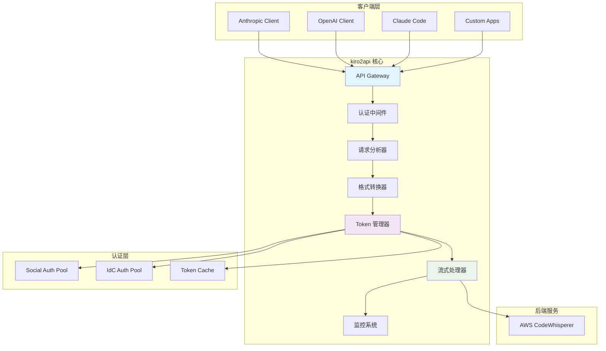

# kiro2api

**高性能 AI API 代理服务器**

*统一 Anthropic Claude、OpenAI 和 AWS CodeWhisperer 的智能网关*

[](https://golang.org/)
[](https://github.com/gin-gonic/gin)
[](https://www.docker.com/)

## 核心特性

### 1. Claude Code 原生集成

```bash
# 一行配置，立即享受本地代理
export ANTHROPIC_BASE_URL="http://localhost:8080/v1"
export ANTHROPIC_API_KEY="your-kiro-token"

# Claude Code 无感切换，所有功能完美支持
claude-code --model claude-sonnet-4 "帮我重构这段代码"
```

**支持功能**:
- 完整 Anthropic API 兼容
- 流式响应零延迟
- 工具调用完整支持
- 多模态图片处理

### 2. 多账号池管理

```json
{
  "多账号配置": [
    {"auth": "Social", "refreshToken": "个人账号1"},
    {"auth": "Social", "refreshToken": "个人账号2"},
    {"auth": "IdC", "refreshToken": "企业账号"}
  ],
  "选择策略": "sequential - 按配置顺序依次使用"
}
```

**核心特性**:
- **顺序选择**: 按配置顺序依次使用账号
- **故障转移**: 账号用完自动切换到下一个
- **使用监控**: 实时监控每个账号的使用情况

### 3. 双认证方式支持

```bash
# Social 认证
KIRO_AUTH_TOKEN='[{"auth":"Social","refreshToken":"your-social-token"}]'

# IdC 认证
KIRO_AUTH_TOKEN='[{
  "auth":"IdC",
  "refreshToken":"enterprise-token",
  "clientId":"enterprise-client-id",
  "clientSecret":"enterprise-secret"
}]'

# 混合认证 - 最佳实践
KIRO_AUTH_TOKEN='[
  {"auth":"IdC","refreshToken":"primary-enterprise"},
  {"auth":"Social","refreshToken":"backup-personal"}
]'
```

### 4. 图片输入支持（data URL）

```bash
# Claude Code 中直接使用图片
claude-code "分析这张图片的内容" --image screenshot.png

# 支持的图片格式
✅ data URL 的 PNG/JPEG 等常见格式
⚠️ 目前仅支持 `data:` URL，不支持远程 HTTP 图片地址
```

**说明**:
- Claude Code 传入本地图片时会转为 `data:` URL，服务端按照 `Anthropic`/`OpenAI` 规范解析并转发。
- 不做额外图片压缩或远程下载处理，避免引入不必要复杂度（KISS/YAGNI）。

## 系统架构



## 项目结构

```
cmd/kiro2api/               # 主程序入口，负责加载运行时配置
internal/runtime/           # 应用启动器，统一编排认证与 HTTP 服务
internal/adapter/httpapi/   # HTTP 适配层：路由、处理中间件与控制器
internal/adapter/upstream/  # 上游代理层：ReverseProxy、Anthropic/OpenAI 适配器
```

新的分层结构通过 `internal/adapter/upstream/shared.ReverseProxy` 统一封装上游请求发送，
所有流式与非流式转发逻辑都以策略形式注入 `anthropic`/`openai` 适配器，确保代码职责更加清晰。

## 核心功能矩阵

| 特性分类 | 功能 | 支持状态 | 描述 |
|----------|------|----------|------|
| **API 兼容** | Anthropic API | ✅ | 完整的 Claude API 支持 |
| | OpenAI API | ✅ | ChatCompletion 格式兼容 |
| **负载管理** | 单账号 | ✅ | 基础 Token 管理 |
| | 多账号池 | ✅ | 顺序负载均衡 |
| | 故障转移 | ✅ | 自动切换机制 |
| **认证方式** | Social 认证 | ✅ | AWS SSO 认证 |
| | IdC 认证 | ✅ | 身份中心认证 |
| | 混合认证 | ✅ | 多认证方式并存 |
| **监控运维** | 基础日志 | ✅ | 标准日志输出 |
| | 使用监控 | ✅ | 实时使用量统计 |
| **性能优化** | 流式响应 | ✅ | SSE 实时传输 |
| | 智能缓存 | ✅ | Token 缓存（无响应缓存） |
| | 并发控制 | ✅ | Token 刷新并发控制 |

### 高级特性

| 特性 | 描述 | 技术实现 |
|------|------|----------|
| **多模态支持** | data URL 的 PNG/JPEG 图片 | Base64 编码 + 格式转换 |
| **工具调用** | 完整 Anthropic 工具使用支持 | 状态机 + 生命周期管理 |
| **格式转换** | Anthropic ↔ OpenAI ↔ CodeWhisperer | 智能协议转换器 |
| **零延迟流式** | 实时流式传输优化 | EventStream 解析 + 对象池 |
| **顺序选择** | 按配置顺序使用 Token | 顺序轮换 + 故障转移 |

## 技术栈

- **Web框架**: gin-gonic/gin v1.11.0
- **JSON处理**: bytedance/sonic v1.14.1
- **配置管理**: github.com/joho/godotenv v1.5.1
- **Go版本**: 1.24.0
- **容器化**: Docker & Docker Compose 支持

## 快速开始

### 基础运行

```bash
# 克隆并编译
git clone <repository-url>
cd kiro2api
go build -o kiro2api ./cmd/kiro2api

# 配置环境变量
cp .env.example .env
# 编辑 .env 文件，设置 KIRO_AUTH_TOKEN

# 启动服务器
./kiro2api

# 测试API
curl -X POST http://localhost:8080/v1/messages \
  -H "Content-Type: application/json" \
  -H "Authorization: Bearer 123456" \
  -d '{"model": "claude-sonnet-4-20250514", "max_tokens": 100, "messages": [{"role": "user", "content": "你好"}]}'
```

### Docker 部署

#### 快速开始

Token获取方式：
- Social tokens: 通常在 ~/.aws/sso/cache/kiro-auth-token.json
- IdC tokens: 在 ~/.aws/sso/cache/ 目录下的相关JSON文件中

```bash
# 方式一：使用 docker-compose（推荐）
docker-compose up -d

# 方式二：预构建镜像
docker run -d \
  --name kiro2api \
  -p 8080:8080 \
  -e KIRO_AUTH_TOKEN='[{"auth":"Social","refreshToken":"your_token"}]' \
  -e KIRO_CLIENT_TOKEN="123456" \
  ghcr.io/caidaoli/kiro2api:latest

# 方式三：本地构建
docker build -t kiro2api .
docker run -d \
  --name kiro2api \
  -p 8080:8080 \
  --env-file .env \
  kiro2api
```

#### 配置管理

##### 环境变量文件
```bash
# .env.docker
# 多账号池配置
KIRO_AUTH_TOKEN='[
  {
    "auth": "Social",
    "refreshToken": "arn:aws:sso:us-east-1:999999999999:token/refresh/xxx"
  },
  {
    "auth": "IdC",
    "refreshToken": "arn:aws:identitycenter::us-east-1:999999999999:account/instance/xxx",
    "clientId": "https://oidc.us-east-1.amazonaws.com/clients/xxx",
    "clientSecret": "xxx-secret-key-xxx"
  }
]'

# 服务配置
KIRO_CLIENT_TOKEN=your-secure-token
PORT=8080
GIN_MODE=release

# 生产级日志
LOG_LEVEL=info
LOG_FORMAT=json
LOG_CONSOLE=true

```

#### 隐身模式（Stealth Mode）

为了在不改变外部接口的前提下重构所有对外网络指纹，服务新增了一套可配置的隐身模式：

- `STEALTH_MODE`：开启后会随机化 TLS、HTTP/2、请求头以及上游请求节奏；**默认启用**以使用 Kiro IDE 真实请求头格式。
- `HEADER_STRATEGY`：在 `real_simulation`（**Kiro IDE 真实格式，推荐**）与 `random`（完全随机组合）之间切换。
- `STEALTH_HTTP2_MODE`：控制 HTTP/2 行为，支持 `auto`（随机）、`force` 或 `disable`。

> ⚙️ 这些开关在 Zeabur 平台上无需额外脚本即可通过环境变量配置，完全兼容现有的 `nixpacks.toml` 与 `Procfile`。

**环境变量示例**

```bash
# 推荐配置（使用 Kiro IDE 真实请求头格式）
STEALTH_MODE=true
HEADER_STRATEGY=real_simulation
STEALTH_HTTP2_MODE=auto
```

**Kiro IDE 真实请求头格式**

当 `STEALTH_MODE=true` 且 `HEADER_STRATEGY=real_simulation`（默认）时，服务会生成与真实 Kiro IDE 完全一致的请求头：

```bash
# 示例请求头（自动生成）：
x-amz-user-agent: aws-sdk-js/1.0.0 KiroIDE-0.4.0-954cd22dda111dffc3592dc86986f7e9860c20f6ba8201a62cbd92f69950e7c0
user-agent: aws-sdk-js/1.0.0 ua/2.1 os/win32#10.0.26200 lang/js md/nodejs#22.19.0 api/codewhispererruntime#1.0.0 m/E KiroIDE-0.4.0-954cd22dda111dffc3592dc86986f7e9860c20f6ba8201a62cbd92f69950e7c0

# 稳定的用户画像（绑定到 token，每周可能轻微变化）：
# - Kiro 版本号（85% 使用最新版 0.4.0，15% 使用旧版 0.3.5-0.3.9）
# - 操作系统版本（Windows/macOS/Linux）
# - Node.js 版本（18-22）
# - UA 版本（2.0-2.5）
# - 模式标识（E/A/B/C/D）
# - Accept-Language 偏好
# - 机器 ID（machineID）
#
# 每次会话变化的元素：
# - 64 位 SHA256 哈希签名（每次请求不同，但版本号等保持稳定）
```

**配置说明**

- `STEALTH_MODE=true|false`：设置为 `true`（**推荐**）时启用所有随机化功能并使用 Kiro IDE 真实请求头格式。若设为 `false`，服务会延续传统固定指纹（已过时，不推荐）。
- `HEADER_STRATEGY=real_simulation|random`：
  - `real_simulation`（**默认，推荐**）：生成符合真实 Kiro IDE 抓包数据的请求头格式，包括正确的 SDK 版本、操作系统信息和 KiroIDE 签名哈希。
  - `random`：构造包含随机版本号与哈希的头部，模拟 AWS 官方工具包（已过时）。
- `STEALTH_HTTP2_MODE=auto|force|disable`：`auto` 会在 HTTP/2 与 HTTP/1.1 之间动态切换；`force` 强制启用 HTTP/2；`disable` 则固定使用 HTTP/1.1。根据目标上游的兼容性在环境变量中选择即可。

隐身能力的代码拆分如下所示，便于审计与扩展：

- `internal/adapter/upstream/shared/header_manager.go`：生成真实或随机的请求头，并注入追踪与语言首选项。
- `internal/adapter/upstream/shared/reverse_proxy.go`：统一接入隐身 Header、JSON 随机化与请求抖动。
- `utils/client.go`：随机化 TLS 版本、CipherSuite 顺序和 HTTP/2 行为，打散底层指纹。
- `utils/conversation_id.go`：将会话与代理延续 ID 改为 UUIDv4，避免依赖客户端特征。
- `converter/codewhisperer.go`：在隐身模式下随机选择 JSON 缩进方案，改变请求体字节布局。
- `config/stealth.go`：集中管理所有隐身配置项。
- `.env.example`、`internal/runtime/runtime.go`：提供默认环境示例与运行时提示，方便在 Zeabur 上启停隐身模式。

##### Docker Secrets（注意事项）
```bash
# 若使用 Docker Secrets，请将 `KIRO_AUTH_TOKEN` 设置为 secrets 文件路径：
# 例如：/run/secrets/kiro_auth_token
#
# 说明：代码支持将 `KIRO_AUTH_TOKEN` 当作"文件路径"读取；
#      但不支持 `*_FILE` 环境变量约定，也不读取 `KIRO_CLIENT_TOKEN_FILE`。
```

#### 健康检查和监控

```bash
# 健康检查
docker exec kiro2api wget -qO- http://localhost:8080/v1/models

# 查看日志
docker logs -f kiro2api

# 监控资源使用
docker stats kiro2api

# 进入容器调试
docker exec -it kiro2api sh
```

### Zeabur 部署

> 若首次使用 Zeabur，可参考 [`doc/DEPLOY_ZEABUR.md`](doc/DEPLOY_ZEABUR.md) 获取详细图文教程。

1. Fork 仓库或直接将本仓库导入 GitHub，并在 Zeabur 控制台选择 **Deploy from Git**。
2. 确保根目录存在的 `nixpacks.toml` 与 `Procfile` 被检测到（Zeabur 会自动使用 Nixpacks 构建 Go 二进制）。
3. 在 **Environment** 面板新增：
   - `KIRO_AUTH_TOKEN`：JSON 字符串或 Zeabur Secret 文件路径。
   - `KIRO_CLIENT_TOKEN`：32 位以上随机字符串，用于 API 访问。
   - `STEALTH_MODE` / `HEADER_STRATEGY` / `STEALTH_HTTP2_MODE`：按需启用隐身模式，无需修改构建脚本。
   - 可选：`GIN_MODE=release`、`LOG_LEVEL=info`、`LOG_FORMAT=json`。
4. 点击 **Deploy**，等待构建完成后使用 Zeabur 自动分配的域名访问。

部署完成后可以执行以下命令进行验证：

```bash
curl -H "Authorization: Bearer $KIRO_CLIENT_TOKEN" \
  https://<your-zeabur-domain>/v1/models
```

如需更多细节（自动部署、日志采集、自定义域名等），请查看 [Zeabur 部署指南](doc/DEPLOY_ZEABUR.md)。

## API 接口

### 支持的端点

- `GET /` - 静态首页（Dashboard）
- `GET /static/*` - 静态资源
- `GET /api/tokens` - Token 池状态与使用信息（无需认证）
- `GET /v1/models` - 获取可用模型列表
- `POST /v1/messages` - Anthropic Claude API 兼容接口（支持流/非流）
- `POST /v1/messages/count_tokens` - Token 计数接口
- `POST /v1/chat/completions` - OpenAI ChatCompletion API 兼容接口（支持流/非流）

### 认证方式

所有 `/v1/*` 端点都需要在请求头中提供认证信息（`/api/tokens` 等管理端点无需认证）：

```bash
# 使用 Authorization Bearer 认证
Authorization: Bearer your-auth-token

# 或使用 x-api-key 认证
x-api-key: your-auth-token
```

### 请求示例

```bash
# Anthropic API 格式
curl -X POST http://localhost:8080/v1/messages \
  -H "Content-Type: application/json" \
  -H "Authorization: Bearer 123456" \
  -d '{
    "model": "claude-sonnet-4-20250514",
    "max_tokens": 1000,
    "messages": [
      {"role": "user", "content": "你好，请介绍一下你自己"}
    ]
  }'

# OpenAI API 格式
curl -X POST http://localhost:8080/v1/chat/completions \
  -H "Content-Type: application/json" \
  -H "Authorization: Bearer 123456" \
  -d '{
    "model": "claude-sonnet-4-20250514",
    "messages": [
      {"role": "user", "content": "解释一下机器学习的基本概念"}
    ]
  }'

# 流式请求（添加 "stream": true）
curl -N -X POST http://localhost:8080/v1/messages \
  -H "Content-Type: application/json" \
  -H "Authorization: Bearer 123456" \
  -d '{
    "model": "claude-sonnet-4-20250514",
    "max_tokens": 200,
    "stream": true,
    "messages": [{"role": "user", "content": "讲个故事"}]
  }'
```

## 支持的模型

| 公开模型名称 | 内部 CodeWhisperer 模型 ID |
|-------------|---------------------------|
| `claude-sonnet-4-5-20250929` | `CLAUDE_SONNET_4_5_20250929_V1_0` |
| `claude-sonnet-4-20250514` | `CLAUDE_SONNET_4_20250514_V1_0` |
| `claude-3-7-sonnet-20250219` | `CLAUDE_3_7_SONNET_20250219_V1_0` |
| `claude-3-5-haiku-20241022` | `auto` |

## 环境配置指南

### 多账号池配置

#### 配置方式对比

| 配置方式 | 适用场景 | 优势 | 限制 |
|----------|----------|------|------|
| **JSON 配置** | 生产级部署 | 多认证方式、顺序负载均衡 | 配置相对复杂 |
| **环境变量** | 快速测试 | 简单直接、向后兼容 | 功能有限 |

#### JSON 格式配置（推荐）

**多账号池配置示例：**

```bash
# 完整的生产级配置
export KIRO_AUTH_TOKEN='[
  {
    "auth": "Social",
    "refreshToken": "arn:aws:sso:us-east-1:999999999999:token/refresh/social-token-1",
    "description": "开发团队主账号"
  },
  {
    "auth": "Social",
    "refreshToken": "arn:aws:sso:us-east-1:999999999999:token/refresh/social-token-2",
    "description": "开发团队备用账号"
  },
  {
    "auth": "IdC",
    "refreshToken": "arn:aws:identitycenter::us-east-1:999999999999:account/instance/idc-token",
    "clientId": "https://oidc.us-east-1.amazonaws.com/clients/enterprise-client",
    "clientSecret": "enterprise-secret-key",
    "description": "生产级账号"
  }
]'
```

### 系统配置

#### 基础服务配置

```bash
# === 核心配置 ===
KIRO_CLIENT_TOKEN=your-secure-api-key    # API 认证密钥（建议使用强密码）
PORT=8080                                # 服务端口
GIN_MODE=release                         # 运行模式：debug/release/test

```

#### 生产级日志配置

```bash
# === 日志系统 ===
LOG_LEVEL=info                           # 日志级别：debug/info/warn/error
LOG_FORMAT=json                          # 日志格式：text/json
LOG_CONSOLE=true                         # 控制台输出开关
LOG_FILE=/var/log/kiro2api.log          # 日志文件路径（可选）

# === 结构化日志字段 ===
# 自动包含以下字段：
# - timestamp: 时间戳
# - level: 日志级别
# - service: 服务名称
# - request_id: 请求唯一标识
# - user_id: 用户标识（如果可用）
# - token_usage: Token 使用情况
# - response_time: 响应时间
```

#### 工具配置

```bash
# === 工具限制 ===
MAX_TOOL_DESCRIPTION_LENGTH=10000        # 工具描述的最大长度（字符数，默认：10000）
                                        # 用于限制 tool description 字段的长度
                                        # 防止超长内容导致上游 API 错误
```

## 故障排除

### 故障诊断

#### Token 认证问题

```bash
# 检查配置
echo $KIRO_AUTH_TOKEN

# 启用调试日志
LOG_LEVEL=debug ./kiro2api
```

| 错误类型 | 解决方案 |
|----------|----------|
| JSON 格式错误 | 使用 JSON 验证器检查格式 |
| 认证方式错误 | 确认 `auth` 字段为 "Social" 或 "IdC" |
| 参数缺失 | IdC 认证需要 `clientId` 和 `clientSecret` |
| Token 过期 | 查看日志中的刷新状态 |

#### API 连接问题

```bash
# 测试 API 连通性
curl -v -H "Authorization: Bearer 123456" \
  http://localhost:8080/v1/models

# 测试流式响应
curl -N --max-time 60 -X POST \
  http://localhost:8080/v1/messages \
  -H "Content-Type: application/json" \
  -H "Authorization: Bearer 123456" \
  -d '{"model": "claude-sonnet-4-20250514", "stream": true, "messages": [{"role": "user", "content": "测试"}]}'
```

#### Docker 部署问题

| 问题类型 | 症状 | 解决方案 |
|----------|------|----------|
| **容器启动失败** | 容器立即退出 | 检查环境变量配置，查看容器日志 |
| **端口冲突** | 端口已被占用 | 修改 docker-compose.yml 中的端口映射 |
| **数据卷权限** | AWS SSO 缓存失败 | 确保容器用户有权限访问数据卷 |
| **网络连接** | 无法访问外部 API | 检查 Docker 网络配置和防火墙设置 |

```bash
# Docker 故障排除命令
# 查看容器状态
docker ps -a

# 查看容器日志
docker logs kiro2api --tail 100 -f

# 检查容器内部
docker exec -it kiro2api sh
ps aux
netstat -tlnp
env | grep KIRO

# 检查服务连通性（本地）
docker exec kiro2api wget -qO- http://localhost:8080/v1/models || echo "服务不可用"

# 重新构建和启动
docker-compose down -v
docker-compose build --no-cache
docker-compose up -d

# 检查资源使用
docker stats kiro2api
```

#### Claude Code 集成问题

| 问题类型 | 症状 | 解决方案 |
|----------|------|----------|
| **代理连接失败** | Claude Code 无法连接到 kiro2api | 检查 baseURL 和网络连通性 |
| **认证失败** | 401 Unauthorized 错误 | 验证 apiKey 配置和 KIRO_CLIENT_TOKEN |
| **流式响应中断** | 流式输出不完整 | 检查网络稳定性和超时配置 |

```bash
# Claude Code 集成调试
# 测试基础连接
curl -H "Authorization: Bearer $KIRO_CLIENT_TOKEN" \
  http://localhost:8080/v1/models

# 测试流式响应
curl -N -H "Authorization: Bearer $KIRO_CLIENT_TOKEN" \
  -H "Content-Type: application/json" \
  -d '{"model":"claude-sonnet-4-20250514","stream":true,"messages":[{"role":"user","content":"test"}]}' \
  http://localhost:8080/v1/messages
```

## 更多资源

- **详细开发指南**: [CLAUDE.md](./CLAUDE.md)
- **包结构说明**: 分层架构设计，遵循 SOLID 原则
- **性能优化**: 缓存策略、并发控制、内存管理
- **核心开发任务**: 扩展功能、性能调优、高级特性
- **Claude Code 官方文档**: [claude.ai/code](https://claude.ai/code)
- **Docker 最佳实践**: 容器化部署指南

## 贡献指南

我们欢迎社区贡献！直接提交 Issue 或 Pull Request 即可。

### 快速贡献

1. Fork 项目
2. 创建特性分支 (`git checkout -b feature/amazing-feature`)
3. 提交更改 (`git commit -m 'Add amazing feature'`)
4. 推送到分支 (`git push origin feature/amazing-feature`)
5. 创建 Pull Request
